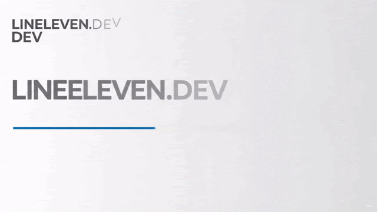

# LINEELEVEN.DEV

  

**Premium custom designs and websites that actually work.**

LINEELEVEN.DEV is a Nairobi-based, remote-first digital agency specializing in internal dashboards, client portals, and high-performance websites.

## ✨ Features

- 🎨 Scroll-triggered background color transitions
- 📸 Before/after interactive comparison slider
- 🔄 Continuous auto-scrolling gallery
- 🎬 Split hero layout with GIF showcase
- 🌊 Animated gradient background
- 📱 Fully responsive design
- 💬 WhatsApp & Email integration

## 🎨 Color Palette

| Role | Color |
|------|-------|
| Pacific Blue | `#009FB7` |
| Mustard | `#FED766` |
| Shadow Grey | `#272727` |

## 🛠️ Built With

- HTML5
- CSS3
- JavaScript
- Vercel

## 🌍 Location

Nairobi, Kenya — serving clients globally, remote-first.

## 🔗 Live Demo

[https://lineleven.dev](https://lineleven.dev.vercel.app/)

## 📧 Contact

lineeleven.dev@protonmail.com

---

*Premium custom designs and websites that actually work.*
